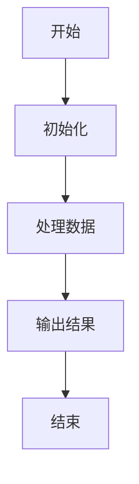
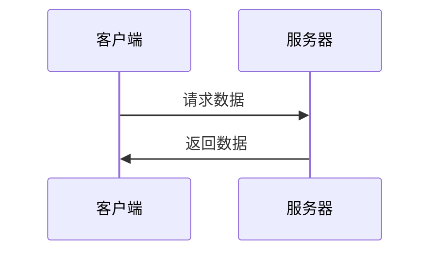
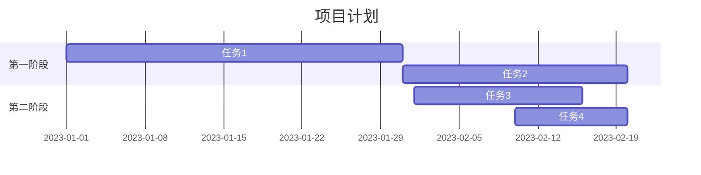

# Mermaid 图表测试

这是一个测试 mermaid 图表渲染的示例文章。

## 流程图示例

下面是一个简单的流程图：

```mermaid
graph TD
    A[开始] --> B[初始化]
    B --> C[处理数据]
    C --> D[输出结果]
    D --> E[结束]
```

## 序列图示例

下面是一个简单的序列图：

```mermaid
sequenceDiagram
    participant 客户端
    participant 服务器
    客户端->>服务器: 请求数据
    服务器->>客户端: 返回数据
```

## 甘特图示例

下面是一个简单的甘特图：

```mermaid
gantt
    title 项目计划
    dateFormat  YYYY-MM-DD
    section 第一阶段
    任务1 :a1, 2023-01-01, 30d
    任务2 :after a1, 20d
    section 第二阶段
    任务3 :2023-02-01, 15d
    任务4 :2023-02-10, 10d
```
