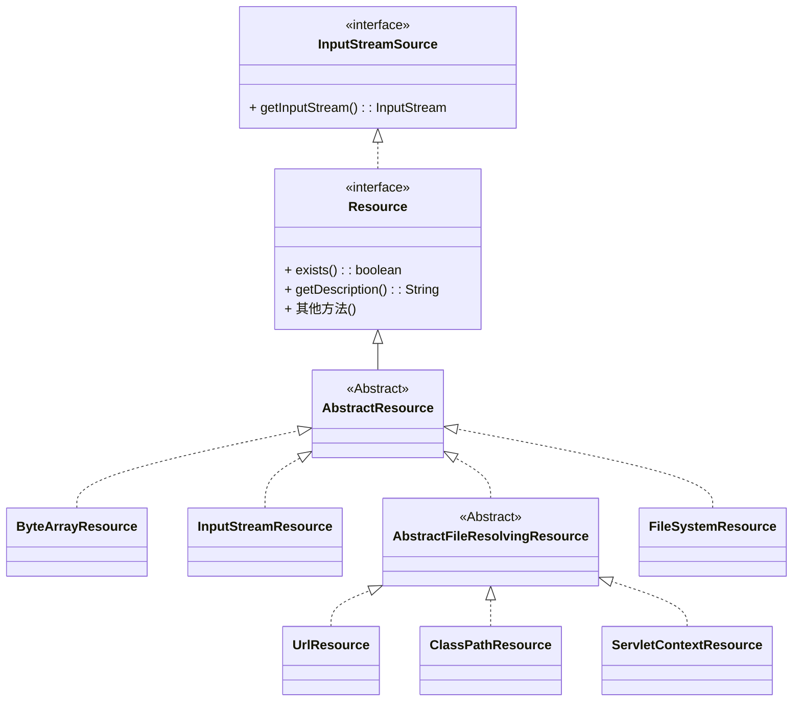

这个是io库的一部分, 将若干io对象统一起来
- java.io.File
- java.net.URL
- Class.getResource()
这个统一的接口就是Resource, 可以读取文件, 类路径资源, URL资源, web context resource, 字节数组等

这与io对象来源解耦合

# 主要接口
org.springframework.core.io.中的
## Resource 接口
继承了InputStreamSource接口

如打开一个inputStream用于读取资源
判断存在与否, 打开与否, 返回URL, 返回FILE等(如果来源是File或者url的话)

## ResourceLoader
这是一个策略接口, 用于加载Resource
只有一个核心方法, getResource(String location)

Spring的ApplicationContext就继承了ResourceLoader, 所以context自己可以很方便的getResource

# Resource实现类与加载
ResourceLoader会根据配置, 自动选择对应的实现
这个匹配过程, 是通过资源字符串的前缀实现的
UrlResource: 如前缀 http: https:
ClassPathResource, 如classpath:
FileSystemResource, 如 file:
ServletContextResource
ByteArrayResource, 

如果没有前缀, ApplicationContext会根据自己的类型选择Resource加载

# Resource 字符串的 通配符

ResourcePatternResolver接口支持ant风格的路径通配符, ?单个字符, \*任意字符 \*\*任意目录

特别的 ,classpath\*, 会扫描所有classpath

