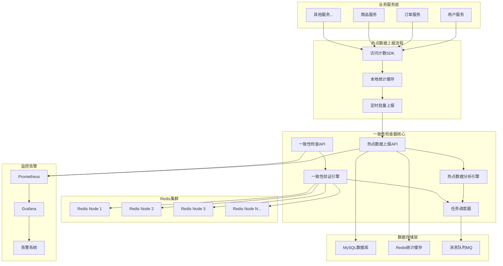
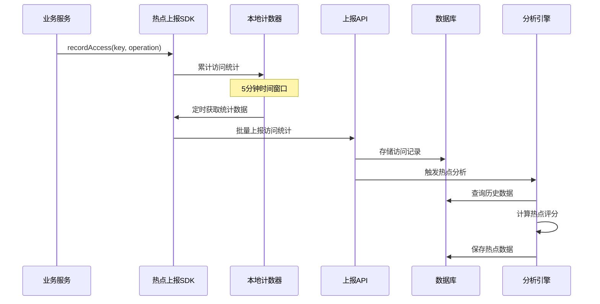
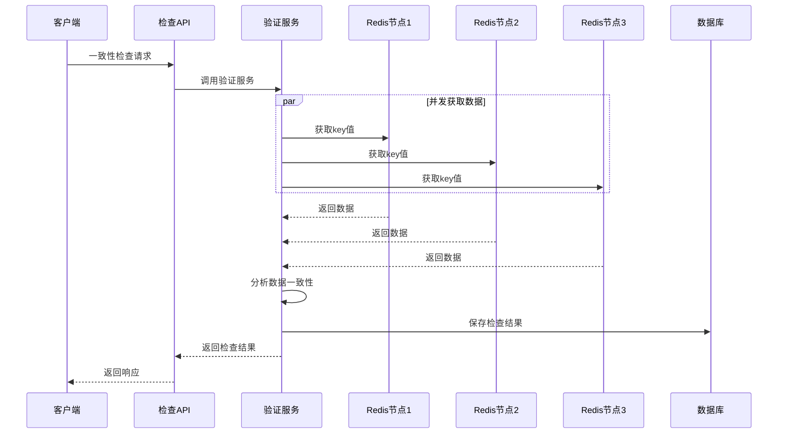

# 分布式缓存一致性检查器架构分析

  

## 1. 系统架构流程图

  

### 1.1 整体架构图

  



  

### 1.2 热点数据上报流程

  



  

### 1.3 一致性检查流程

  



  

## 2. 存在的问题分析

  

### 2.1 架构设计问题

  

#### 2.1.1 单点故障风险

**问题描述**：

- 一致性检查器作为单体应用，存在单点故障风险

- 热点数据分析引擎如果宕机，会影响整个热点检测功能

  

**影响程度**：🔴 高风险

```

风险场景：

1. 应用服务器宕机 → 所有检查功能不可用

2. 数据库连接失败 → 无法存储和查询数据

3. Redis连接异常 → 一致性检查功能失效

```

  

#### 2.1.2 数据一致性问题

**问题描述**：

- 热点数据上报和一致性检查之间缺乏数据同步机制

- 多个服务实例同时上报可能导致数据竞争

  

**影响程度**：🟡 中等风险

```java

// 潜在问题示例

// 服务A上报：user:123 访问100次

// 服务B上报：user:123 访问50次

// 可能导致数据覆盖或统计不准确

```

  

#### 2.1.3 缺乏事务管理

**问题描述**：

- 批量上报处理中，部分成功部分失败时缺乏回滚机制

- 一致性检查结果存储失败时，可能导致数据丢失

  

### 2.2 性能瓶颈问题

  

#### 2.2.1 数据库性能瓶颈

**问题描述**：

- 大量热点数据上报会对数据库造成写入压力

- 历史数据查询可能影响实时业务

  

**性能影响**：

```

预估数据量：

- 100个服务 × 1000个热点键 × 12次/小时 = 120万条记录/小时

- 单表日增长：2880万条记录

- 月增长：8.6亿条记录

```

  

#### 2.2.2 Redis连接池限制

**问题描述**：

- 大规模一致性检查时，可能耗尽Redis连接池

- 并发检查多个节点时，连接数呈指数增长

  

### 2.3 可靠性问题

  

#### 2.3.1 网络异常处理不足

**问题描述**：

- Redis节点网络异常时，缺乏重试和降级机制

- 上报失败时，本地数据可能丢失

  

#### 2.3.2 数据校验不完整

**问题描述**：

- 上报数据缺乏完整性校验

- 恶意数据可能影响热点分析结果

  

## 3. 性能评估

  

### 3.1 吞吐量评估

  

#### 3.1.1 热点数据上报性能

```

测试场景：批量上报1000条记录

预期性能指标：

- QPS: 500-1000 requests/second

- 响应时间: P95 < 200ms, P99 < 500ms

- 内存使用: < 512MB per instance

```

  

**性能瓶颈分析**：

```java

// 当前实现的性能问题

@Transactional  // 大事务可能导致锁等待

public BatchReportResult processBatchReport(BatchAccessReportRequest request) {

    for (AccessReportItem item : request.getAccessReports()) {

        // 逐条处理，性能较差

        accessReportMapper.insert(report);  // 单条插入

        updateRealTimeStats(item, serviceName);  // 每次都访问Redis

    }

}

```

  

**优化建议**：

```java

// 批量插入优化

public BatchReportResult processBatchReport(BatchAccessReportRequest request) {

    // 批量插入数据库

    accessReportMapper.batchInsert(reports);

  

    // 批量更新Redis统计

    pipeline.multi();

    for (AccessReportItem item : items) {

        pipeline.hincrBy(statsKey, "access_count", item.getAccessCount());

    }

    pipeline.exec();

}

```

  

#### 3.1.2 一致性检查性能

```

测试场景：检查1000个键在3个节点的一致性

预期性能指标：

- 并发度: 10-50 threads

- 检查速度: 100-500 keys/second

- 内存使用: < 1GB per task

```

  

**性能瓶颈**：

1. **网络延迟**：每个键需要访问多个Redis节点

2. **串行处理**：当前实现中键的检查是串行的

3. **内存占用**：大批量检查时内存使用量较高

  

### 3.2 资源使用评估

  

#### 3.2.1 内存使用分析

```

组件内存使用预估：

- Spring Boot应用基础: 200MB

- 本地统计缓存: 100MB (10万个键)

- 一致性检查缓存: 500MB (大批量任务)

- JVM堆外内存: 200MB

总计: ~1GB per instance

```

  

#### 3.2.2 CPU使用分析

```

CPU密集型操作：

- 热点数据分析算法: 中等CPU使用

- 数据序列化/反序列化: 低CPU使用

- 网络I/O处理: 低CPU使用

预估CPU使用率: 20-40% (正常负载)

```

  

### 3.3 扩展性限制

  

#### 3.3.1 水平扩展限制

**当前限制**：

- 数据库单点写入瓶颈

- 缺乏分布式任务调度

- 状态数据存储在本地内存

  

**扩展能力评估**：

```

单实例处理能力：

- 热点上报: 1000 QPS

- 一致性检查: 100 keys/second

- 支持Redis节点: 10-50个

  

集群扩展预期：

- 3个实例: 3000 QPS上报, 300 keys/second检查

- 需要解决数据分片和任务分配问题

```

  

#### 3.3.2 存储扩展限制

```

数据增长预估：

- 热点数据表: 100GB/年

- 访问记录表: 1TB/年

- 检查结果表: 50GB/年

  

存储优化需求：

- 数据分区策略

- 历史数据归档

- 冷热数据分离

```

  

## 4. 扩展性问题分析

  

### 4.1 架构扩展性问题

  

#### 4.1.1 微服务拆分需求

**当前问题**：

- 单体应用难以独立扩展不同功能模块

- 热点检测和一致性检查耦合度较高

  

**拆分建议**：

```

建议的微服务架构：

1. 热点数据收集服务 (Hot Data Collector)

2. 热点数据分析服务 (Hot Data Analyzer)

3. 一致性检查服务 (Consistency Checker)

4. 任务调度服务 (Task Scheduler)

5. 配置管理服务 (Config Manager)

```

  

#### 4.1.2 数据存储扩展性

**分库分表需求**：

```sql

-- 按时间分区

CREATE TABLE access_reports_202312 PARTITION OF access_reports

FOR VALUES FROM ('2023-12-01') TO ('2024-01-01');

  

-- 按服务名分片

CREATE TABLE hot_data_stats_user_service AS

SELECT * FROM hot_data_stats WHERE service_name = 'user-service';

```

  

### 4.2 功能扩展性问题

  

#### 4.2.1 检测算法扩展

**当前限制**：

- 热点检测算法固化在代码中

- 难以动态调整检测策略

  

**扩展方案**：

```java

// 策略模式实现算法扩展

public interface HotDataDetectionStrategy {

    List<HotDataItem> detect(DetectionContext context);

}

  

@Component

public class LFUHotDataDetectionStrategy implements HotDataDetectionStrategy {

    // LFU算法实现

}

  

@Component

public class SlidingWindowHotDataDetectionStrategy implements HotDataDetectionStrategy {

    // 滑动窗口算法实现

}

```

  

#### 4.2.2 一致性检查维度扩展

**当前限制**：

- 只检查数据内容一致性

- 缺乏TTL、类型、版本等维度检查

  

**扩展需求**：

```java

public interface ConsistencyChecker {

    ConsistencyResult check(String key, List<CacheNode> nodes);

}

  

// 内容一致性检查器

public class ContentConsistencyChecker implements ConsistencyChecker {

    // 检查数据内容是否一致

}

  

// TTL一致性检查器

public class TTLConsistencyChecker implements ConsistencyChecker {

    // 检查过期时间是否一致

}

  

// 类型一致性检查器

public class TypeConsistencyChecker implements ConsistencyChecker {

    // 检查数据类型是否一致

}

```

  

### 4.3 集成扩展性问题

  

#### 4.3.1 多种缓存系统支持

**当前限制**：

- 只支持Redis

- 难以扩展到其他缓存系统

  

**扩展方案**：

```java

public interface CacheOperations {

    CacheValue getValue(String nodeId, String key);

    Set<String> getAllKeys(String nodeId);

    Map<String, CacheValue> batchGetValues(String nodeId, List<String> keys);

}

  

@Component

public class RedisCacheOperations implements CacheOperations {

    // Redis实现

}

  

@Component

public class MemcachedCacheOperations implements CacheOperations {

    // Memcached实现

}

```

  

#### 4.3.2 监控系统集成

**当前限制**：

- 只预留了Prometheus接口

- 缺乏多种监控系统支持

  

## 5. 优化建议

  

### 5.1 短期优化（1-2个月）

  

#### 5.1.1 性能优化

```java

// 1. 批量数据库操作

@Service

public class OptimizedHotDataReportService {

  

    @Async

    @Transactional

    public CompletableFuture<BatchReportResult> processBatchReportAsync(

            BatchAccessReportRequest request) {

  

        // 批量插入优化

        List<AccessReport> reports = convertToEntities(request);

        accessReportMapper.batchInsert(reports);

  

        // 异步更新统计

        updateStatsAsync(request.getAccessReports(), request.getServiceName());

  

        return CompletableFuture.completedFuture(buildResult(request));

    }

}

```

  

#### 5.1.2 缓存优化

```java

// 2. 本地缓存优化

@Component

public class CachedConsistencyValidator {

  

    @Cacheable(value = "consistency-results", key = "#key + ':' + #nodeIds")

    public ConsistencyResult validateKeyWithCache(String key, List<String> nodeIds) {

        return consistencyValidator.validateKey(key, nodeIds);

    }

}

```

  

### 5.2 中期优化（3-6个月）

  

#### 5.2.1 架构重构

```yaml

# 微服务拆分

services:

  hot-data-collector:

    image: consistency/hot-data-collector

    replicas: 3

  

  hot-data-analyzer:

    image: consistency/hot-data-analyzer

    replicas: 2

  

  consistency-checker:

    image: consistency/consistency-checker

    replicas: 5

```

  

#### 5.2.2 数据存储优化

```sql

-- 分区表设计

CREATE TABLE access_reports (

    id BIGINT AUTO_INCREMENT,

    service_name VARCHAR(64),

    report_time TIMESTAMP,

    -- 其他字段

    PRIMARY KEY (id, report_time)

) PARTITION BY RANGE (UNIX_TIMESTAMP(report_time)) (

    PARTITION p202312 VALUES LESS THAN (UNIX_TIMESTAMP('2024-01-01')),

    PARTITION p202401 VALUES LESS THAN (UNIX_TIMESTAMP('2024-02-01'))

);

```

  

### 5.3 长期优化（6-12个月）

  

#### 5.3.1 智能化升级

```java

// 机器学习热点预测

@Component

public class MLHotDataPredictor {

  

    public List<PredictedHotData> predictHotData(String serviceName, int hours) {

        // 基于历史数据预测未来热点

        return mlModel.predict(getHistoricalData(serviceName, hours));

    }

}

```

  

#### 5.3.2 自动化运维

```yaml

# Kubernetes自动扩缩容

apiVersion: autoscaling/v2

kind: HorizontalPodAutoscaler

metadata:

  name: consistency-checker-hpa

spec:

  scaleTargetRef:

    apiVersion: apps/v1

    kind: Deployment

    name: consistency-checker

  minReplicas: 2

  maxReplicas: 10

  metrics:

  - type: Resource

    resource:

      name: cpu

      target:

        type: Utilization

        averageUtilization: 70

```

  

## 6. 总结

  

### 6.1 当前架构优势

- ✅ 模块化设计清晰

- ✅ 非侵入式热点检测

- ✅ 支持大规模并发检查

- ✅ 预留了丰富的扩展接口

  

### 6.2 主要问题

- ❌ 单点故障风险

- ❌ 数据库性能瓶颈

- ❌ 缺乏分布式架构

- ❌ 扩展性有限

  

### 6.3 优化优先级

1. **高优先级**：性能优化、批量处理、异步处理

2. **中优先级**：微服务拆分、数据分片、缓存优化

3. **低优先级**：智能化升级、自动化运维、多系统集成

  

通过分阶段的优化改进，可以将当前的单体架构逐步演进为高性能、高可用的分布式系统。