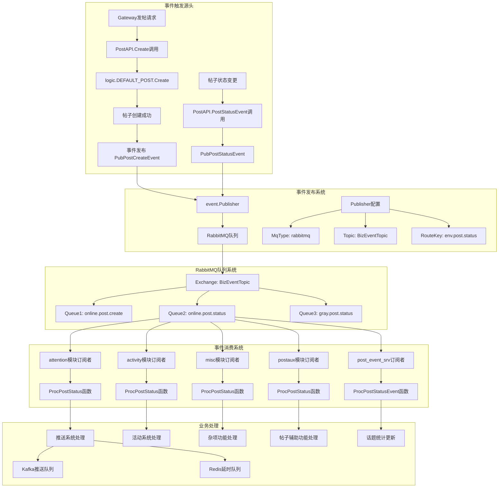

```mermaid
graph TB
    subgraph "事件触发源头"
        A[Gateway发帖请求] --> B[PostAPI.Create调用]
        B --> C[logic.DEFAULT_POST.Create]
        C --> D[帖子创建成功]
        D --> E[事件发布 PubPostCreateEvent]
        
        F[帖子状态变更] --> G[PostAPI.PostStatusEvent调用]
        G --> H[PubPostStatusEvent]
    end
    
    subgraph "事件发布系统"
        E --> I[event.Publisher]
        H --> I
        I --> J[RabbitMQ队列]
        
        I1[Publisher配置]
        I1 --> I1A["MqType: rabbitmq"]
        I1 --> I1B["Topic: BizEventTopic"] 
        I1 --> I1C["RouteKey: env.post.status"]
    end
    
    subgraph "RabbitMQ队列系统"
        J --> K[Exchange: BizEventTopic]
        K --> L1[Queue1: online.post.create]
        K --> L2[Queue2: online.post.status]
        K --> L3[Queue3: gray.post.status]
    end
    
    subgraph "事件消费系统"
        L2 --> M1[attention模块订阅者]
        L2 --> M2[activity模块订阅者]
        L2 --> M3[misc模块订阅者]
        L2 --> M4[postaux模块订阅者]
        L2 --> M5[post_event_srv订阅者]
        
        M1 --> N1[ProcPostStatus函数]
        M2 --> N2[ProcPostStatus函数]
        M3 --> N3[ProcPostStatus函数]
        M4 --> N4[ProcPostStatus函数]
        M5 --> N5[ProcPostStatusEvent函数]
    end
    
    subgraph "业务处理"
        N1 --> O1[推送系统处理]
        N2 --> O2[活动系统处理]
        N3 --> O3[杂项功能处理]
        N4 --> O4[帖子辅助功能处理]
        N5 --> O5[话题统计更新]
        
        O1 --> P1[Kafka推送队列]
        O1 --> P2[Redis延时队列]
    end
```

