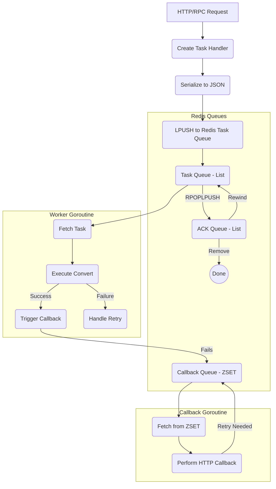

一个任务首先被Lpush到主队列

一个worker获取一个task, 并将这个消息RPOPLPUSH转移到ack队列
然后反序列化消息并尝试执行, 得到成功, 重试状态

ack:
- 使用一个独立的ack 队列检查起, 如果一个任务已经成功, 就将其从ack队列移除
- 如果一个任务特殊失败(超时, download失败,等),  就将其重放回主队列等待消费
- 如果超过重试次数, 就丢弃

回调也带重试:
- 一个goroutine处理, 立马执行, 如果出错, 就将其加入一个zset使用指数退避重试
- 分数使用指数退避, 进行延迟重试

问题:
- 重试后, 这个顺序可能是不对的

注意:
- 本质一个msg是一个序列化的字符串, 每次取出来都要反序列化, 放进去又要序列化
- 一个task从主队列RPOPLPUSH到ACK中, 是同一个msg, 同一个版本
- 然后处理这个msg, 如果成功, 就将这个msg标记为成功, 让ack管理者删除
- 如果失败, 就将msg标记失败, 让ack队列删除, 然后减少重试次数, 重序列化得到msgv2放到主队列中去
